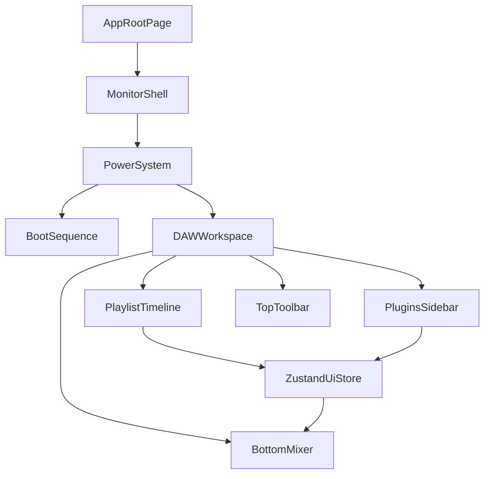

# Studio Monitor Portfolio Implementation Plan

## 1) Product Direction

- Create a **single immersive workstation experience** first (not a generic multi-section website).
- The website visually reads as a **physical monitor on a desk**, with all UI living inside the screen.
- The internal interface is a professional, FL Studio-inspired DAW metaphor for software/data engineering work.

## 2) Stack Decision (Final)

- **Framework**: Next.js (App Router) + TypeScript
  - Supports long-term portfolio expansion (SEO pages, case studies, metadata) without re-platforming.
- **Styling**: Tailwind CSS v4 + CSS variables
  - Fast UI iteration for dense dashboards; tokenized neon/dark theme system.
- **Motion**: GSAP (`@gsap/react`) + Framer Motion (hybrid)
  - GSAP for complex, timed choreography (boot sequence, reveal transitions, EQ animation envelopes).
  - Framer Motion for smaller interactions (button press, hover glow, folder expand/collapse).
- **State**: Zustand
  - Lightweight global control for power state, selected timeline block, and mixer output.
- **Data**: Typed local modules (`.ts` data source)
  - Reliable, fast, and easy to maintain before introducing CMS complexity.

## 3) UX Blueprint (From Your Vision)

- **Monitor Hardware Layer**
  - Dark matte bezel wraps the app.
  - Bottom-right tactile power button.
  - Off state: black screen + dim red LED.
  - On state: green LED + BIOS-style boot + DAW reveal.

- **DAW Workspace**
  - Left: `Plugins` browser with folders for Languages, Frameworks, Developer Tools; file-like items (`Python.vst`, etc.).
  - Center: playlist timeline with two tracks:
    - Track 1: Experience (neon blocks)
    - Track 2: Projects (subtle waveform texture blocks)
  - Bottom: mixer panel with:
    - animated EQ bars based on selected item tech stack
    - patch notes panel (role, achievements, links)
  - Top: toolbar with profile readout, decorative BPM (graduation year), and transport controls.

- **Visual Style**
  - FL-inspired dark theme (`#121212` family), structured grid lines, high-saturation accents (cyan/lime/magenta).
  - Screen glass effect: inner shadow + faint scanline overlay.
  - Explicitly exclude hint panels, CPU meters, and sample-folder clutter.

## 4) Architecture and File Layout

- `src/app/layout.tsx` - root shell and metadata setup.
- `src/app/page.tsx` - immersive workstation entry.
- `src/components/monitor/*` - bezel, LED button, screen overlay.
- `src/components/boot/*` - BIOS/boot visual sequence.
- `src/components/daw/*` - sidebar, timeline, mixer, toolbar.
- `src/lib/store/uiStore.ts` - global UI + selection state.
- `src/lib/data/careerData.ts` - typed experience/projects/skills.
- `src/styles/tokens.css` - theme tokens (colors, glow, spacing, z-index, motion).

## 5) Performance Gates (Hard Requirements)

- Maintain near-60 FPS during:
  - power-on boot sequence
  - timeline block selection + mixer update
- Avoid sustained drops below 45 FPS on modern laptops.
- Core Web Vitals target:
  - LCP <= 2.5s
  - INP <= 200ms
  - CLS <= 0.1
- Lighthouse target:
  - Performance >= 90 before final sign-off.
- Animation constraints:
  - Prefer `transform` and `opacity`; avoid layout-triggering animation properties.
  - Keep overlays cheap; avoid heavy fullscreen blur stacks.
  - Respect `prefers-reduced-motion`.

## 6) Execution Milestones

### Milestone A - Foundation
- Scaffold app and folders.
- Add token system and base typography/grid.
- Build static monitor shell frame.

### Milestone B - Power + Boot
- Implement power toggle logic and LED states.
- Add boot sequence and transition into DAW.
- Ensure clean state reset from On -> Off -> On.

### Milestone C - DAW Core UI
- Build Plugins sidebar, Playlist timeline, and Top toolbar.
- Implement selectable timeline blocks and selected glow behavior.

### Milestone D - Mixer Intelligence
- Build EQ rack and Patch Notes.
- Connect selected timeline item to mixer animation + content.

### Milestone E - Performance + QA
- Profile animation and paint costs.
- Tune for mobile/tablet breakpoints.
- Final accessibility and reduced-motion pass.

## 7) Definition of Done

- Power system and boot flow match the monitor metaphor.
- All DAW sections are present and visually cohesive.
- Timeline selection updates mixer and patch notes correctly.
- Performance gates are met.
- UI is responsive, accessible, and polished for portfolio use.
